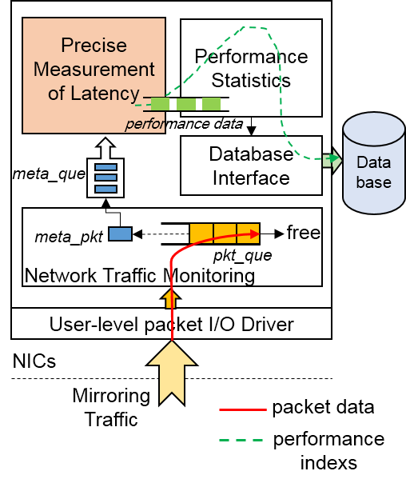
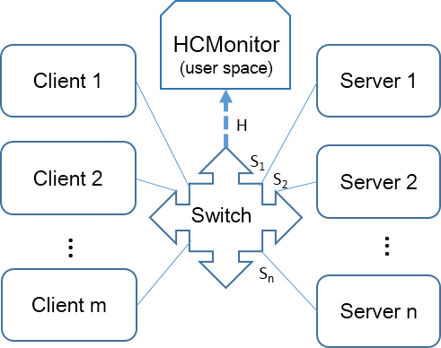

# HCMonitor (High Concurrent Monitor)

HCMonitor is a monitor system for high concurrent network services, which is developed on user-level and estimates response latency from requests input to responses output, called server-side latency. The measurement is transparent for network services by switch mirroring traffic, and finally displays the real-time results including latency CDF distribution, average delay, concurrency and throughput. 

### Release Notes

**V 1.1**

+ Improved throughput to 10Gbps
+ Multi-core receiving packets and pipelined processing
+ self-defined configuration by setting.cfg

**V 1.0**

+ Fully monitoring
+ Accurate measurement of per-request latency
+ Transparent for network services
+ DPDK-based

### Architecture
 
 

### Prerequisites
* libdpdk (Intel's DPDK package*, DPDK-19.08 best) 
* libnuma
* libconfig
* mysql
* mysqlclient
* python2.7      

### Included directories

```bash
./    
|__HCMonitor/	HCMonitor src files  
|__deps/        Install dir of HCMontior dependent libraries(dpdk and libconfig)            
|__downloads/   dpdk-19.11.4 and libconfig installation packages
```

### Installation

#### libconfig & DPDK intsall

```bash
$ chmod a+x install.sh
$ ./install.sh
     - Press [38] x86_64-native-linux-gcc to compile the package
     - Press [45] Insert IGB UIO module to install the driver
     - Press [49] Setup hugepage mappings for NUMA systems to setup hugepages(20GB for each node best)
     - Press [51] Bind Ethernet/Baseband/Crypto device to IGB UIO module
     - Press [62] Exit Script to quit the tool
We use dpdk/ submodule as our DPDK driver. FYI, you can pass a different dpdk source directory as command line argument.
```
**Introduction to Compatible NIC**
Only those devices will work with DPDK drivers that are listed on this page: http://dpdk.org/doc/nics. Please make sure that your NIC is compatible before moving on to the next step.

#### Setup HCMonitor 

#### Compile
```bash
$ cd <path to HCMonitor>
$ vim Makefile
  # Add two configurations at the beginning as below
  RTE_SDK= <path to HCMonitor>/deps/dpdk-stable-19.11.4
  RTE_TARGET=x86_64-native-linuxapp-gcc
$ make
```
The executable application monitor will be generated under build/

#### Run

configure the switch port (H) connected to HCMonitor to mirror the inbound and outbound traffic from port S1 to Sn, which represents the ports connected to servers.



TestBed：
CPU：Intel(R) Xeon(R) Gold 6130 CPU @ 2.10GHz

Mem：128GB

OS：CentOS Linux release 7.4.1708

Kernel：3.10.0-957.el7.x86_64

NIC：82599 10 Gigabit Dual Port Network Connection 10fb

Configure the file setting.cfg according to own needs, for example (Monitor higher than 10000000 connections) :
```bash
$ vim setting.cfg
    rx_queues      = 4      //packets rx_burst queues(cores)
    pr_queues      = 4      //packets process queues(cores)
    interval       = 60     //latency CDF calculate period(s) for output in cdf.txt
    buffer_pkt     = 80000000 //length of the packets buffer copied from rte_mbuf
	enableHTTP     = 1      //Test the normal HTTP traffic
	label_offset   = 6      //label location offset in payload bytes(count from 0)
	request_label  = [0,2]  //request label for judging if a packet is a request
	response_label = [1,3]  //response label for judging if a packet is a response

**Note: We Must apply non-root user privileges to compile HCMonitor, other
wise the comiling will be stopped.**

$ make
```
For start parameter description, please execute
```bash
$ build/monitor -h
-c COREMASK: Hexadecimal bitmask of cores to run on
-p PORTMASK: A hexadecimal bitmask of the ports to configure 
-n CHANNELS: Number of memory channels
```
Start Examples(-c fff for 12 cores, -p1 for 1 NIC port)
```bash
$ ./build/monitor -c fff -n3 -- -p1
```
**Introduction to Results Output**
Open cdf.txt to check the latency CDF distribution, average delay and concurrency periodicity.

### Frequently asked questions

1. How can I quit the application?

Use Ctrl+C to gracefully shutdown the application. Or you can kill process with “pkill” command in Linux.


### Roadmap

+ Extend to multi-queue receiving packets.
+ Support more protocols and performance metrics.
+ carry out more detailed service detection such as packet loss and abnormal disconnection.

### Contacts

The issue board is the preferred way to report bugs and ask questions about HCMonitor or contact Zhang Wenli(zhangwl at ict.ac.cn).

### Acknowledgement
 HCMonitor is a monitor system for high concurrent network services, which estimates response latency from requests input to responses output, called server-side latency. The version 1.1 is able to support 10 million concurrent TCP long connections and 10Gbps throughput. The work was supported by the Strategic Priority Research Program of the Chinese Academy of Sciences under Grant No. XDA06010401, the National Key Research and Development Program of China under Grant No. 2016YFB1000203 & 2017YFB1001602. We appreciated project leaders, Prof. Xu Zhiwei, Prof. Chen Mingyu and Prof. Bao Yungang, for their selfless support and guidance.

### References

> [1] Song, H, Zhang, W, Liu, K, Shen, Y, Chen, M. HCMonitor: An accurate measurement system for high concurrent network services. Concurrency Computat Pract Exper. 2021;e6081. https://doi.org/10.1002/cpe.6081.

